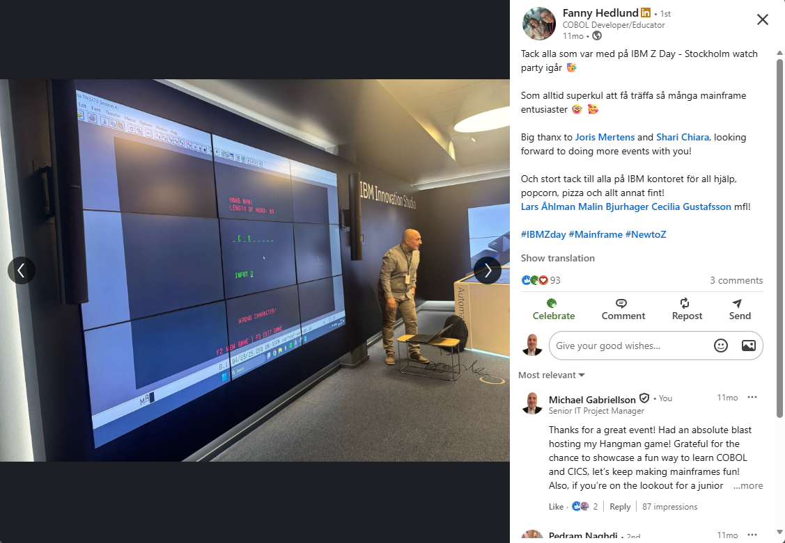

# COBOL/CICS Hangman Game

## 🚀 Project Summary

A COBOL/CICS-based interactive Hangman game built on a mainframe environment, showing how user interactions are handled step by step in a CICS application, DB2 integration, and BMS-driven screen handling.

The application was presented during IBM Z Day, showcasing real-time interaction and transaction-based processing in a CICS environment.

---

## 🎯 What this project demonstrates

- Building interactive applications in a CICS environment  
- Managing state using pseudo-conversational design  
- Integrating COBOL with DB2 using embedded SQL  
- Designing terminal UIs using BMS maps  
- Handling user input and validation in a transactional system  
---

## 📸 Demo



---

## ⚙️ Technologies Used

- COBOL
- CICS (Customer Information Control System)
- BMS Maps (Basic Mapping Support for screen handling)
- DB2
- SQL (embedded in COBOL)

---

## 🧠 Key Features

- Pseudo-conversational transaction flow using CICS
- User input handling via EIBAID (ENTER, PF keys)
- State management using COMMAREA
- Dynamic screen updates using BMS maps
- Random word selection from DB2
- Interactive gameplay with win/loss logic

---

## 🔄 Application Flow

1. User starts the application (PF2)
2. A random word is retrieved from DB2
3. The user inputs guesses via the terminal
4. The application updates the UI dynamically
5. Game ends on win or loss condition

---

## 💻 Code Highlights

### CICS Transaction Handling
```cobol
EVALUATE TRUE
  WHEN EIBAID = DFHENTER
  WHEN EIBAID = DFHPF2
```

### DB2 Integration
```cobol
EXEC SQL
  SELECT WORD
  INTO :WORD
  FROM USER11.WORDSDB2
END-EXEC
```

### Iterative Input Processing
```cobol
PERFORM VARYING WS-POS FROM 1 BY 1 UNTIL WS-POS > 10
```

---

## 🖥️ BMS Maps

The project includes full BMS map definitions in the `words.bms` file, used to control screen layout and user interaction in the CICS environment.

Below is a simplified excerpt from the mapset:

```cobol
INSMAP   DFHMSD TYPE=&SYSPARM,
               MODE=INOUT,
               CTRL=FREEKB,
               LANG=COBOL,
               MAPATTS=COLOR,
               STORAGE=AUTO

HOMESCR  DFHMDI SIZE=(24,80),LINE=1,COLUMN=1

DFHMDF POS=(01,28),
       LENGTH=26,
       ATTRB=PROT,
       COLOR=GREEN,
       INITIAL='GROUP 3 GRADUATION PROJECT'

ACTION   DFHMDF POS=(03,16),
       LENGTH=1,
       ATTRB=(UNPROT,IC),
       PICIN='X(01)',
       PICOUT='X(01)',
       COLOR=TURQUOISE
```

These maps are used together with CICS `SEND` and `RECEIVE` commands to manage terminal-based UI, including protected/unprotected fields, input validation, and dynamic screen updates.

---

## 🧩 Notes

The application demonstrates how COBOL programs interact with BMS maps to create structured terminal interfaces, where field attributes (e.g. PROT, UNPROT) control user input and screen behavior.

---

## 📌 Purpose

This project was developed to gain hands-on experience with COBOL, CICS, DB2, and BMS, focusing on how interactive systems are implemented in a transactional mainframe environment.
